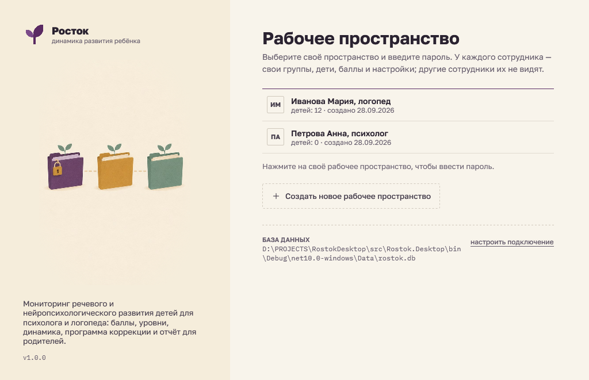
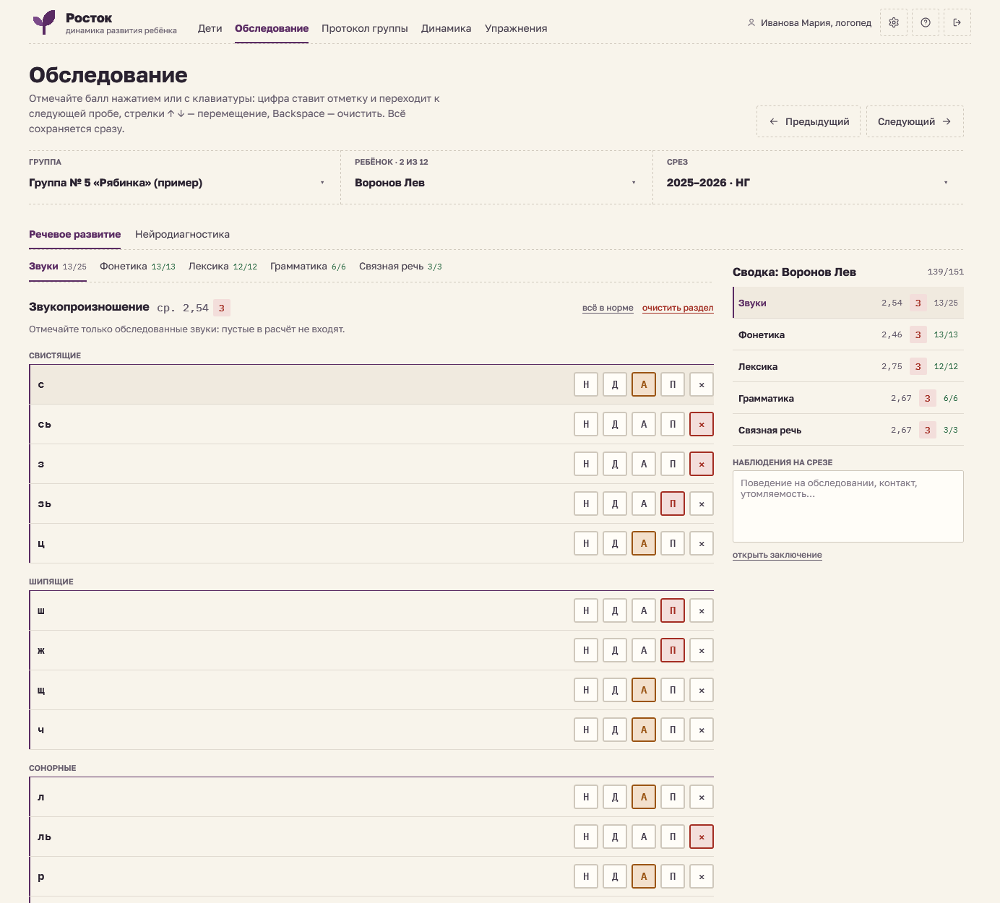
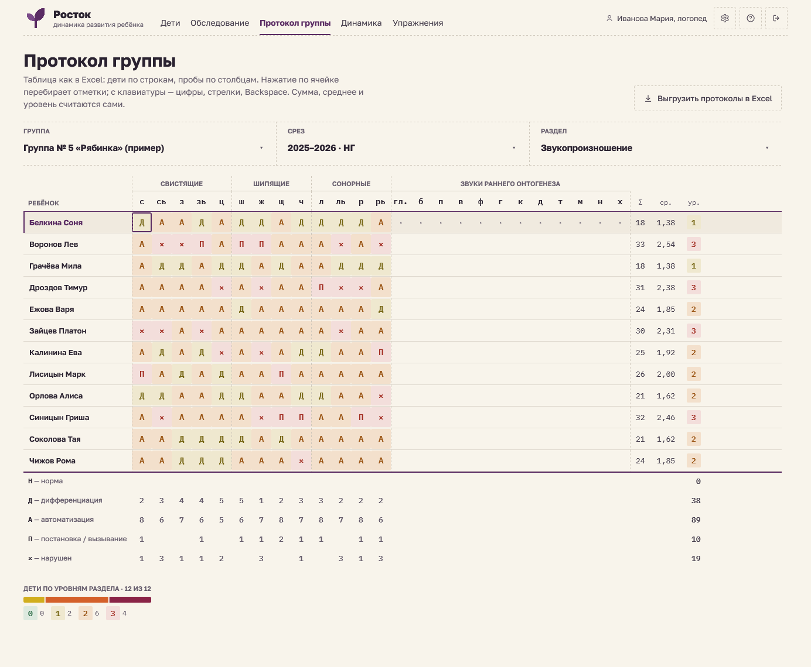
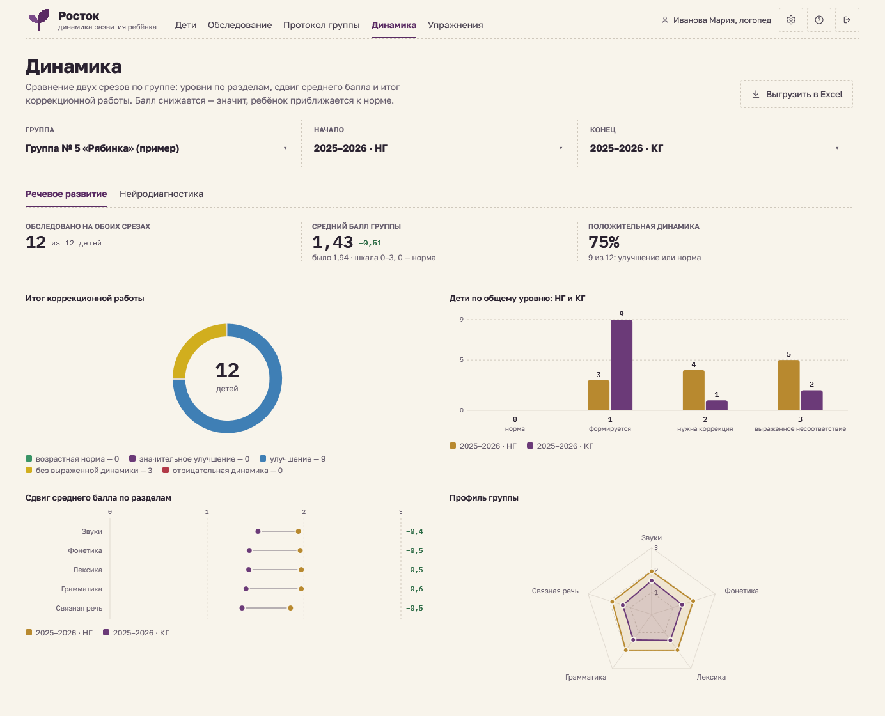
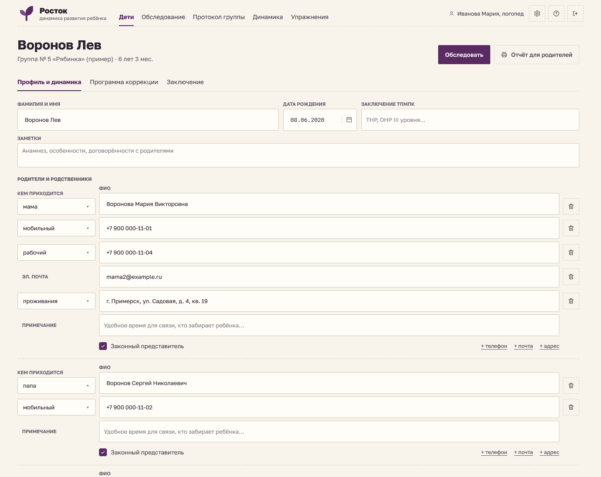
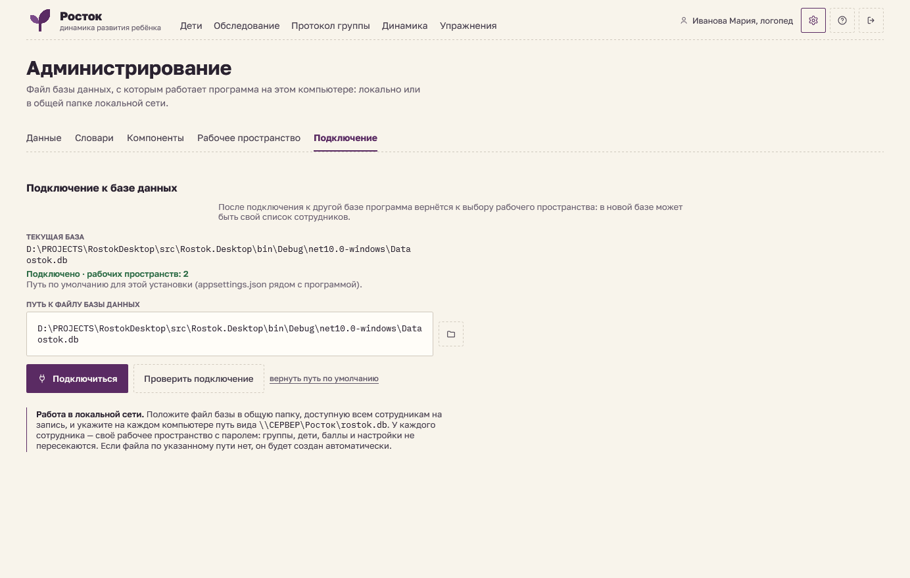
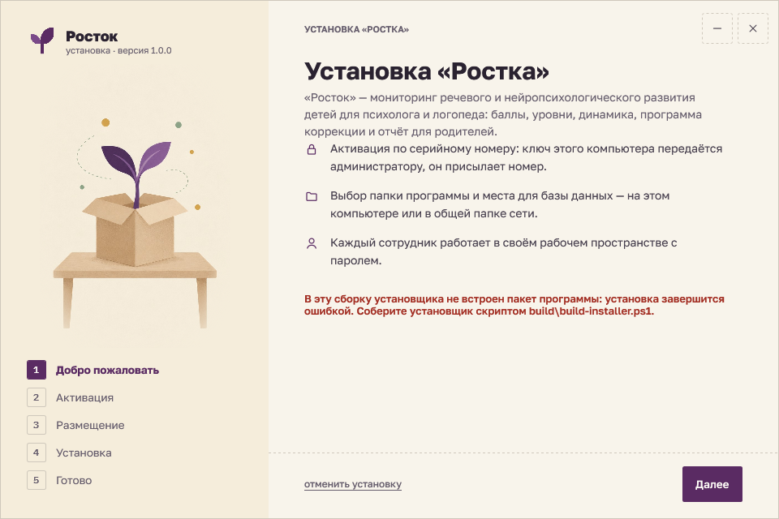
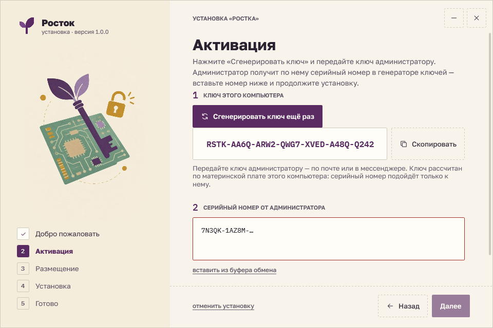
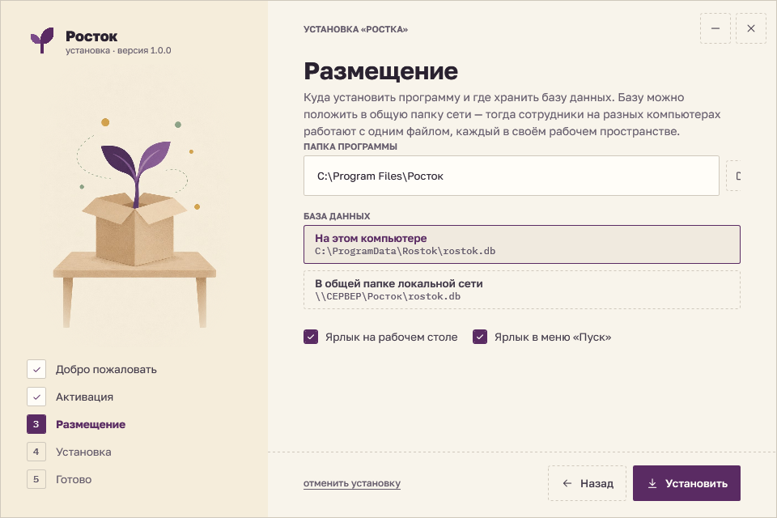
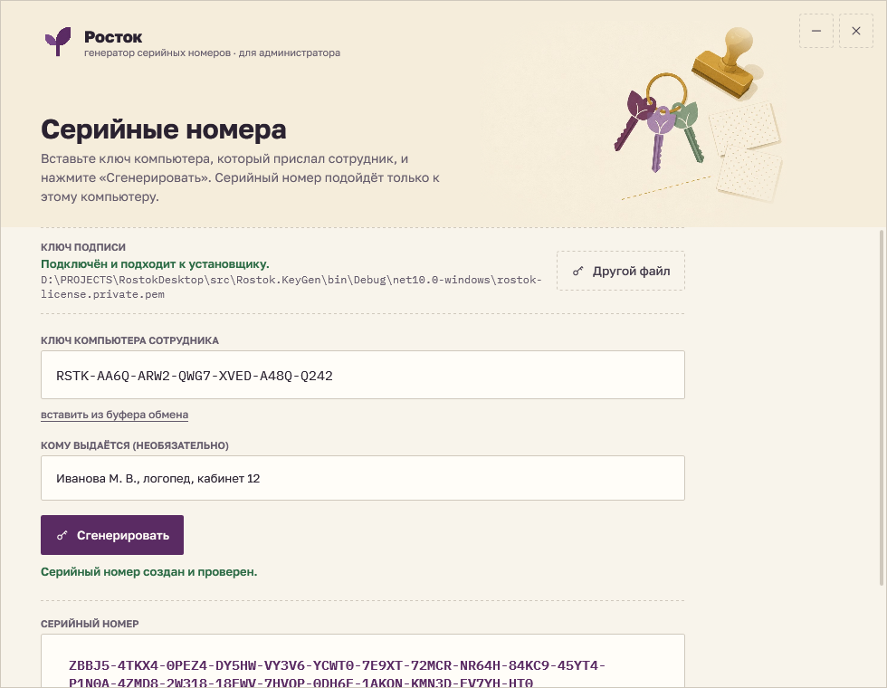

# Росток для Windows

Настольное приложение (WPF, .NET 10) для детского психолога и логопеда: мониторинг речевого и нейропсихологического развития детей. Полностью повторяет дизайн и возможности веб-версии [«Росток»](https://github.com/GamoffVad/rostok) — баллы 0–3, уровни, протокол группы, динамика с графиками, программа коррекции, заключение и отчёт для родителей — и добавляет то, что нужно в учреждении: **общую базу данных в локальной сети и рабочие пространства сотрудников с паролями**.



## Возможности

| Экран | Что делает |
|---|---|
| **Дети** | список группы, возраст, родители, заполненность среза, уровни по блокам; добавление по одному (с контактами родителей) или списком из Excel |
| **Обследование** | отметки по пробам кнопками или с клавиатуры (цифра — балл и переход дальше, ↑ ↓, Backspace), «всё в норме», «как на прошлом срезе», сводка по разделам, наблюдения |
| **Протокол группы** | таблица как в Excel: дети × пробы, ввод цифрами и стрелками, Σ / ср. / уровень, итоги по отметкам, выгрузка всех протоколов в Excel |
| **Динамика** | итог коррекционной работы (кольцо), дети по уровням (столбцы), сдвиг по разделам («гантели»), профиль группы (радар), распределение, сводная таблица, Excel |
| **Карта ребёнка** | сведения и контакты родителей, показатели, радар и линия по срезам, уровни по всем срезам; программа коррекции по дефицитам; черновик заключения (печать, копирование) |
| **Отчёт для родителей** | только один ребёнок: выбор разделов, печать / PDF, файл .html, Excel |
| **Упражнения** | библиотека упражнений по каждой пробе, шаблон Excel для заполнения и загрузки |
| **Администрирование** | резервная копия (формат веб-версии), прежний файл Excel, учебные годы; словари; витрина компонентов; **рабочее пространство** (название, пароль, удаление); **подключение к базе** |

| Обследование | Протокол группы |
|---|---|
|  |  |
| **Динамика** | **Карта ребёнка** |
|  |  |

## Рабочие пространства и локальная сеть

- При входе сотрудник **выбирает своё рабочее пространство и вводит пароль** или **создаёт новое**.
- Все данные и настройки — группы, дети, баллы, программы, библиотека упражнений, правки словарей, выбранные группа/срез/раздел — хранятся **только в этом пространстве**; другие сотрудники их не видят.
- Пароль хранится в базе в виде хеша PBKDF2-SHA256 (210 000 итераций) с солью; восстановить его нельзя, сменить — в «Администрирование → Рабочее пространство».
- Несколько сотрудников могут работать с **одним файлом базы в общей папке** (`\\СЕРВЕР\Росток\rostok.db`): запись идёт построчно, журнал SQLite — `DELETE` (режим WAL в сетевой папке не работает).

## База данных

- SQLite-файл **находится в проекте**: [`src/Rostok.Desktop/Data/rostok.db`](src/Rostok.Desktop/Data) (пустая схема), схема — [`schema.sql`](src/Rostok.Core/Resources/schema.sql).
- **Если файла нет, он создаётся автоматически** при запуске — вместе с папкой и всеми таблицами; так же при подключении к новому пути.
- **Настройка подключения** — «Администрирование → Подключение» (и ссылка «настроить подключение» на экране входа, если база недоступна): путь к файлу, выбор или создание файла, проверка, возврат к пути по умолчанию. Путь этого компьютера хранится в `%APPDATA%\Rostok\settings.json`; путь по умолчанию для установки — в `appsettings.json` рядом с программой (его прописывает установщик).
- Резервная копия `.json` совместима с веб-версией: копию из браузера можно восстановить здесь и наоборот.



## Установщик и активация

Установщик `Rostok-Setup-<версия>.exe` — собственный мастер в стиле дизайн-системы с иллюстрациями, созданными в Higgsfield:

| | | |
|---|---|---|
|  |  |  |

1. **Добро пожаловать.**
2. **Активация.** Кнопка «Сгенерировать ключ» считает ключ компьютера по материнской плате (производитель, модель, серийный номер платы + UUID SMBIOS) — `RSTK-XXXX-XXXX-XXXX-XXXX-XXXX-XXXX`. Сотрудник передаёт ключ администратору, администратор получает серийный номер в генераторе ключей, сотрудник вставляет номер и продолжает установку.
3. **Размещение:** папка программы, база на этом компьютере (`C:\ProgramData\Rostok\rostok.db`) или в общей папке сети, ярлыки.
4. **Установка:** файлы, `appsettings.json`, права пользователей на папку базы, лицензия, ярлыки, запись в «Программы и компоненты».
5. **Готово** — запуск программы.

Удаление — из «Программы и компоненты» (`Rostok.exe --uninstall`); **база данных при удалении не трогается**.

### Генератор серийных номеров (для администратора)



`Rostok-KeyGen.exe`: вставить ключ компьютера → «Сгенерировать» → серийный номер (кнопка «Скопировать»), журнал выдачи в `%APPDATA%\Rostok\KeyGen\issued.csv`.

**Как устроена защита.** Серийный номер — подпись ключа компьютера алгоритмом ECDSA P-256. В установщике и программе есть только открытый ключ, поэтому подделать номер без секретного ключа нельзя, а номер одного компьютера не подходит к другому. Программа при запуске проверяет лицензию этого компьютера: скопированная папка без своего номера попросит активацию.

> **Секретный ключ** `keys/rostok-license.private.pem` в репозиторий не попадает (`.gitignore`). Храните его только у администратора и сделайте резервную копию: без него новые номера не выдать. Если ключ потерян или скомпрометирован — создайте новую пару (`openssl ecparam -name prime256v1 -genkey -noout -out keys/rostok-license.private.pem` и `openssl ec -in keys/rostok-license.private.pem -pubout`), замените открытый ключ в [`License.cs`](src/Rostok.Licensing/License.cs) и пересоберите установщик; ранее выданные номера перестанут действовать.

## Библиотека компонентов

`Rostok.Controls` — та же библиотека, что `src/ui` веб-версии, в виде элементов WPF. Витрина со всеми состояниями — «Администрирование → Компоненты».

| Веб-версия (React) | WPF (`Rostok.Controls`) |
|---|---|
| `.btn-primary` / `.btn-ghost` / `.text-action` / `.icon-btn` | стили `PrimaryButton`, `GhostButton`, `TextAction`, `IconButton` (`Ui.Primary(…)` и т. д.) |
| `Dropdown` (plain / light) | `Dropdown` (`Variant = Plain / Light`) |
| `DatePicker` | `DateField` — маска дд.мм.гггг и свой календарь с клавиатурой |
| `Checkbox` | `Checkbox` |
| `Tooltip` (`data-tip`) | стиль `ToolTip` (задержка 300 мс, над элементом) |
| `FilePick` | `FilePick` (диалог и перетаскивание файла) |
| `FilterCard`, `.filters` | `FilterCard`, `FilterBar` |
| `Level`, `Delta`, `DistBar`, `LevelLegend` | `Level`, `Delta`, `DistBar`, `Legends` |
| `Radar`, `Dumbbell`, `Donut`, `TrendLine`, `LevelColumns` | те же графики с подсказками при наведении |
| `Icons` | `Icon` (`IconKind`) — те же контуры 24×24 + шестерёнка администрирования |
| `.tbl`, `.card`, `.subtabs`, `.mark` | `Tbl`, `Ui.Card`, `TabBar`, стили `Mark` / `MarkWide` |

Шрифты Golos Text и IBM Plex Mono встроены в библиотеку (лицензия SIL OFL, файлы лицензий — в `src/Rostok.Controls/Fonts`).

## Структура

```
src/Rostok.Core        методика, расчёты (как calc.js), словари, программа, заключение, SQLite, рабочие пространства, Excel, копия
src/Rostok.Controls    библиотека компонентов, тема «Тёплый мел» / «Ежевика», шрифты, иллюстрации
src/Rostok.Licensing   ключ компьютера, проверка серийного номера, блок активации
src/Rostok.Desktop     приложение: вход, окно, экраны, печать, отчёт .html
src/Rostok.Setup       установщик
src/Rostok.KeyGen      генератор серийных номеров
tests/                 проверки расчётов (совпадение с веб-версией), хранилища, копии, Excel, лицензий
build/                 сборка установщика
```

## Сборка и запуск

Нужен [.NET SDK 10](https://dotnet.microsoft.com/download/dotnet/10.0).

```bash
dotnet run --project src/Rostok.Desktop
```

```bash
dotnet test
```

```bash
pwsh build/build-installer.ps1
```

Сборка установщика кладёт в `artifacts/` файл `Rostok-Setup-<версия>.exe` (один файл, .NET внутри) и папку `Rostok-KeyGen` (секретный ключ копируется рядом, если он есть на этой машине). В отладочной сборке программа не спрашивает лицензию.

Проверка интерфейса без ручных нажатий: `Rostok.exe --selftest отчёт.txt` открывает экраны во временной базе, нажимает кнопки и клавиши и проверяет запись в базу; `Rostok.exe --shots <папка>` сохраняет снимки всех экранов.
